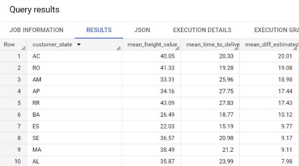

**Name**: Pritam kudale

**Topic**: Project - Business Case: Target SQL

**Batch**: March 2023

**1. Import the dataset and do usual exploratory analysis steps like checking the structure & characteristics of the dataset**

1. **Data type of columns in a table**

**Query : For customer Table**

SELECT

table\_schema, table\_name, column\_name, ordinal\_position, data\_type, is\_hidden FROM `project-387005.project\_target\_sql.INFORMATION\_SCHEMA.COLUMNS`

where table\_name = 'customer';

**Output**

**Query : For geolocation Table**

SELECT

table\_schema, table\_name, column\_name, ordinal\_position, data\_type, is\_hidden FROM `project-387005.project\_target\_sql.INFORMATION\_SCHEMA.COLUMNS`

where table\_name = 'geolocation';

**Output**

**Query : For order\_items Table**

SELECT

table\_schema, table\_name, column\_name, ordinal\_position, data\_type, is\_hidden FROM `project-387005.project\_target\_sql.INFORMATION\_SCHEMA.COLUMNS`

where table\_name = 'order\_items';

**Output**

**Query : For order\_reviews Table**

SELECT

table\_schema, table\_name, column\_name, ordinal\_position, data\_type, is\_hidden FROM `project-387005.project\_target\_sql.INFORMATION\_SCHEMA.COLUMNS`

where table\_name = 'order\_reviews';

**Output**

**Query : For orders Table**

SELECT

table\_schema, table\_name, column\_name, ordinal\_position, data\_type, is\_hidden FROM

`project-387005.project\_target\_sql.INFORMATION\_SCHEMA.COLUMNS`

where

table\_name = 'orders';

**Output**

**Query : For payments Table**

SELECT

table\_schema, table\_name, column\_name, ordinal\_position, data\_type, is\_hidden FROM

`project-387005.project\_target\_sql.INFORMATION\_SCHEMA.COLUMNS`

where

table\_name = 'payments';

**Output**

**Query : For products Table**

SELECT

table\_schema, table\_name, column\_name, ordinal\_position, data\_type, is\_hidden FROM

`project-387005.project\_target\_sql.INFORMATION\_SCHEMA.COLUMNS`

where

table\_name = 'products';

**Output**

**Query : For sellers Table**

SELECT

table\_schema, table\_name, column\_name, ordinal\_position, data\_type, is\_hidden FROM

`project-387005.project\_target\_sql.INFORMATION\_SCHEMA.COLUMNS`

where

table\_name = 'sellers';

**Output**

**Insights:**

All dates have a timestamp format.

All tables have a unique primary key.

2. **Time period for which the data is given**

**Query :**

select

min(order\_purchase\_timestamp) as start\_period,

max(order\_purchase\_timestamp) as end\_period,

date\_diff(max(order\_purchase\_timestamp),min(order\_purchase\_timestamp),day) as no\_of\_days

from

`project\_target\_sql.orders`;

**Insights:**

Start period is 4th Sep 2016 End period is 17 Oct 2018

3. **Cities and States of customers ordered during the given period**

**Query :**

select

o.order\_id,

o.customer\_id,

c.customer\_city,

c.customer\_state,

from

`project\_target\_sql.orders` o join `project\_target\_sql.customer` c ON o.customer\_id = c.customer\_id;

**Insights:**

sao paulo city has highest orders SP state has highest orders

**2. In-depth Exploration:**

1. **Is there a growing trend on e-commerce in Brazil? How can we describe a complete scenario? Can we see some seasonality with peaks at specific months?**

**Query :**

with CTE as (

select

o.order\_id,

extract(month from o.order\_purchase\_timestamp) as month,

extract(year from o.order\_purchase\_timestamp) as year,

p.payment\_value

from

`project\_target\_sql.orders` o join `project\_target\_sql.payments` p on o.order\_id

- p.order\_id)

select

year,month,

count(distinct order\_id) as no\_of\_orders,

round(sum(payment\_value)) as total\_revenue

from

CTE

group by year,month

order by year,month;

**Insights:**

The growing trend in the number of orders is observed from Dec 2016 till Nov 2017 but unable to maintain growth after that.

The number of orders slightly decreased after March 2018 but maintained it above 6000 per month till August 2018.

Orders drastically reduced after November 2018.

Peak is observed in November 2017.

No specific seasonality is observed.

2. **What time do Brazilian customers tend to buy (Dawn, Morning, Afternoon or Night)?**

By considering

Dawn - 5:00:00 to 6:59:59 Morning - 7:00:00 to 11:59:59 Afternoon - 12:00:00 to 16:59:59 Evening - 17:00:00 to 22:59:59 Night - 23:00:00 to 4:59:59 **Query :**

**with time\_CTE as(**

**with CTE as (**

**select**

**order\_id,**

**extract(time from order\_purchase\_timestamp) as time**

**from `project\_target\_sql.orders`)**

**select**

**case**

**when time between '5:00:00' and '6:59:59' then 'Dawn' when time between '7:00:00' and '11:59:59' then 'Morning' when time between '12:00:00'and '16:59:59' then 'Afternoon' when time between '17:00:00' and '22:59:59' then 'Evening' else 'Night'**

**end as day\_time,**

**order\_id**

**from CTE)**

**select**

**day\_time,**

**count(distinct order\_id) as no\_of\_order**

**from time\_CTE**

**group by day\_time**

**order by no\_of\_order desc;**

**Insights:**

Afternoon and Evening is peak time when Brazilian customers tend to buy. Maximum orders are observed in Evening.

3. **Evolution of E-commerce orders in the Brazil region:**
1. **Get month on month orders by states**

**Query :**

with order\_CTE as (

select

o.order\_id,

extract(month from o.order\_purchase\_timestamp) as month,

extract(year from o.order\_purchase\_timestamp) as year, c.customer\_state

from

`project\_target\_sql.orders` o join `project\_target\_sql.customer` c on o.customer\_id = c.customer\_id)

select

customer\_state,

year,

month,

count(order\_id) as no\_of\_orders

from order\_CTE

group by customer\_state,year,month

order by customer\_state,year,month;

**Insights:**

Maximum orders are by state SP in the month of August 2018.

2. **Distribution of customers across the states in Brazil**

**Query :**

**select**

**customer\_state,**

**count(customer\_unique\_id) as no\_of\_customer from**

**`project\_target\_sql.customer`**

**group by customer\_state**

**order by no\_of\_customer desc;**

**Insights:**

SP has maximum customers. RR has minimum customers.

**4. Impact on Economy: Analyse the money movement by e-commerce by looking at order prices, freight and others.**

1. **Get % increase in cost of orders from 2017 to 2018 (include months between Jan to Aug only) - You can use “payment\_value” column in payments table**

**Query :**

select

Y17.month,

y17.total\_revenue as cost\_of\_order\_2017,

y18.total\_revenue as cost\_of\_order\_2018,

round((y18.total\_revenue/y17.total\_revenue) \*100) as percent\_increase from

(with CTE as (

select

o.order\_id,

extract(month from o.order\_purchase\_timestamp) as month,

extract(year from o.order\_purchase\_timestamp) as year, p.payment\_value

from

`project\_target\_sql.orders` o join `project\_target\_sql.payments` p on o.order\_id = p.order\_id

where o.order\_purchase\_timestamp between '2017-01-01 00:00:01 UTC' and '2017-08-31 23:59:59 UTC')

select month, year, round(sum(payment\_value)) as total\_revenue

from CTE

group by month,year

order by year,month) y17 join (with CTE as (

select

o.order\_id,

extract(month from o.order\_purchase\_timestamp) as month,

extract(year from o.order\_purchase\_timestamp) as year, p.payment\_value

from

`project\_target\_sql.orders` o join `project\_target\_sql.payments` p on o.order\_id = p.order\_id

where o.order\_purchase\_timestamp between '2018-01-01 00:00:01 UTC' and '2018-08-31 23:59:59 UTC')

select

month, year,

round(sum(payment\_value)) as total\_revenue

from

CTE

group by month,year

order by year,month) y18 ON y17.month = y18.month order by y17.month;

**Insights:**

January has the highest percent increase in 2018 over 2017. August has the lowest percent increase in 2018 over 2017. Every month has an increasing trend.

2. **Mean & Sum of price and freight value by customer state**

**Query :**

select

c.customer\_state,

round(avg(oi.price),1) as mean\_price,

round(sum(oi.price),1) as total\_price,

round(avg(oi.freight\_value),1) as mean\_freight\_value, round(sum(oi.freight\_value),1) as total\_freight\_value

from

`project\_target\_sql.orders` o

join `project\_target\_sql.order\_items` oi on o.order\_id = oi.order\_id

join `project\_target\_sql.customer` c on o.customer\_id = c.customer\_id group by c.customer\_state

order by c.customer\_state;

**Insights:**

SP has maximum total price and total freight value whereas minimum mean price and mean freight value.

**5. Analysis on sales, freight and delivery time**

1. **Calculate days between purchasing, delivering and estimated delivery**

**Query :**

select

order\_id,

date\_diff(order\_delivered\_customer\_date, order\_purchase\_timestamp,day) as actaual\_period,

date\_diff(order\_estimated\_delivery\_date, order\_purchase\_timestamp,day) as estimated\_period

from

`project\_target\_sql.orders`

where

order\_status = 'delivered'and order\_delivered\_customer\_date is not null;

**Insights:**

Maximum Delivery days needed are 209 whereas fastest delivery is same day delivery. Estimated delivery period is 2 to 155 days.

2. **Find time\_to\_delivery & diff\_estimated\_delivery. Formula for the same given below:**
- **time\_to\_delivery = order\_delivered\_customer\_date-order\_purchase\_timestamp**
- **diff\_estimated\_delivery = order\_estimated\_delivery\_date-order\_delivered\_customer\_date**

**Query :**

select

order\_id,

date\_diff(order\_delivered\_customer\_date, order\_purchase\_timestamp,day) as time\_to\_delivery,

date\_diff(order\_estimated\_delivery\_date, order\_delivered\_customer\_date,day) as diff\_estimated\_delivery

from

`project\_target\_sql.orders`

where

order\_status = 'delivered'and order\_delivered\_customer\_date is not null

order by

diff\_estimated\_delivery;

**Insights:**

Maximum delay period is 188 days.

3. **Group data by state, take mean of freight\_value, time\_to\_delivery, diff\_estimated\_delivery**

**Query :**

select

c.customer\_state,

round(avg(oi.freight\_value),2) as mean\_freight\_value,

round(avg(date\_diff(o.order\_delivered\_customer\_date, o.order\_purchase\_timestamp,day)),2) as mean\_time\_to\_delivery,

round(avg(date\_diff(o.order\_estimated\_delivery\_date, o.order\_delivered\_customer\_date,day)),2) as mean\_diff\_estimated\_delivery

from

`project\_target\_sql.orders` o

join `project\_target\_sql.customer` c on o.customer\_id = c.customer\_id

join `project\_target\_sql.order\_items` oi on o.order\_id = oi.order\_id where

o.order\_status = 'delivered'and o.order\_delivered\_customer\_date is not null group by

c.customer\_state;

**Insights:**

All mean time differences are positive indicating that most of the deliveries are before estimated time.

4. **Sort the data to get the following:**
- **Top 5 states with highest/lowest average freight value - sort in desc/asc limit 5**

**Query :**

**select \* from**

**(select**

**c.customer\_state,**

**round(avg(oi.freight\_value),2) as mean\_freight\_value,**

**round(avg(date\_diff(o.order\_delivered\_customer\_date, o.order\_purchase\_timestamp,day)),2) as mean\_time\_to\_delivery,**

**round(avg(date\_diff(o.order\_estimated\_delivery\_date, o.order\_delivered\_customer\_date,day)),2) as mean\_diff\_estimated\_delivery**

**from**

**`project\_target\_sql.orders` o**

**join `project\_target\_sql.customer` c on o.customer\_id = c.customer\_id**

**join `project\_target\_sql.order\_items` oi on o.order\_id = oi.order\_id where**

**o.order\_status = 'delivered'and o.order\_delivered\_customer\_date is not null group by**

**c.customer\_state**

**order by**

**mean\_freight\_value desc**

**limit 5) top**

**UNION all**

**select \* from**

**(select**

**c.customer\_state,**

**round(avg(oi.freight\_value),2) as mean\_freight\_value,**

**round(avg(date\_diff(o.order\_delivered\_customer\_date, o.order\_purchase\_timestamp,day)),2) as mean\_time\_to\_delivery,**

**round(avg(date\_diff(o.order\_estimated\_delivery\_date, o.order\_delivered\_customer\_date,day)),2) as mean\_diff\_estimated\_delivery**

**from**

**`project\_target\_sql.orders` o**

**join `project\_target\_sql.customer` c on o.customer\_id = c.customer\_id**

**join `project\_target\_sql.order\_items` oi on o.order\_id = oi.order\_id where**

**o.order\_status = 'delivered'and o.order\_delivered\_customer\_date is not null group by**

**c.customer\_state**

**order by**

**mean\_freight\_value**

**limit 5) bottom order by mean\_freight\_value desc;**

**Insights:**

RR, PB, RO, AC, PI are top 5 states for max average freight value. SP, PR, MG, RJ, DF are having lowest average freight value

5. **Top 5 states with highest/lowest average time to delivery**

**Query :**

select \* from

(select

c.customer\_state,

round(avg(oi.freight\_value),2) as mean\_freight\_value,

round(avg(date\_diff(o.order\_delivered\_customer\_date, o.order\_purchase\_timestamp,day)),2) as mean\_time\_to\_delivery,

round(avg(date\_diff(o.order\_estimated\_delivery\_date, o.order\_delivered\_customer\_date,day)),2) as mean\_diff\_estimated\_delivery

from

`project\_target\_sql.orders` o

join `project\_target\_sql.customer` c on o.customer\_id = c.customer\_id

join `project\_target\_sql.order\_items` oi on o.order\_id = oi.order\_id where

o.order\_status = 'delivered'and o.order\_delivered\_customer\_date is not null group by

c.customer\_state

order by

mean\_time\_to\_delivery desc

limit 5) top

UNION all

select \* from

(select

c.customer\_state,

round(avg(oi.freight\_value),2) as mean\_freight\_value,

round(avg(date\_diff(o.order\_delivered\_customer\_date, o.order\_purchase\_timestamp,day)),2) as mean\_time\_to\_delivery,

round(avg(date\_diff(o.order\_estimated\_delivery\_date, o.order\_delivered\_customer\_date,day)),2) as mean\_diff\_estimated\_delivery

from

`project\_target\_sql.orders` o

join `project\_target\_sql.customer` c on o.customer\_id = c.customer\_id

join `project\_target\_sql.order\_items` oi on o.order\_id = oi.order\_id where

o.order\_status = 'delivered'and o.order\_delivered\_customer\_date is not null group by

c.customer\_state

order by

mean\_time\_to\_delivery

limit 5) bottom order by mean\_time\_to\_delivery desc;

**Insights:**

RR, AP, AM, AL, PA are top 5 states for highest average time to delivery. SP, PR, MG, DF, SC are having the lowest average time to delivery.

Lowest time to delivery in SP also has the lowest mean freight value.

6. **Top 5 states where delivery is really fast/ not so fast compared to estimated date**

**Query :**

select \* from

(select

c.customer\_state,

round(avg(oi.freight\_value),2) as mean\_freight\_value,

round(avg(date\_diff(o.order\_delivered\_customer\_date, o.order\_purchase\_timestamp,day)),2) as mean\_time\_to\_delivery,

round(avg(date\_diff(o.order\_estimated\_delivery\_date, o.order\_delivered\_customer\_date,day)),2) as mean\_diff\_estimated\_delivery

from

`project\_target\_sql.orders` o

join `project\_target\_sql.customer` c on o.customer\_id = c.customer\_id

join `project\_target\_sql.order\_items` oi on o.order\_id = oi.order\_id where

o.order\_status = 'delivered'and o.order\_delivered\_customer\_date is not null group by

c.customer\_state

order by

mean\_diff\_estimated\_delivery desc

limit 5) top

UNION all

select \* from

(select

c.customer\_state,

round(avg(oi.freight\_value),2) as mean\_freight\_value,

round(avg(date\_diff(o.order\_delivered\_customer\_date, o.order\_purchase\_timestamp,day)),2) as mean\_time\_to\_delivery,

round(avg(date\_diff(o.order\_estimated\_delivery\_date, o.order\_delivered\_customer\_date,day)),2) as mean\_diff\_estimated\_delivery

from

`project\_target\_sql.orders` o

join `project\_target\_sql.customer` c on o.customer\_id = c.customer\_id

join `project\_target\_sql.order\_items` oi on o.order\_id = oi.order\_id where

o.order\_status = 'delivered'and o.order\_delivered\_customer\_date is not null group by

c.customer\_state

order by

mean\_diff\_estimated\_delivery

limit 5) bottom order by mean\_diff\_estimated\_delivery desc;

**Insights:**

AP, RO, AM, AP, RR are top 5 states for highest positive difference in estimated and actual delivery. i.e. it provides the fastest delivery way before estimated time.

AL, MA, SE, ES, BA have the lowest positive difference in estimated and actual delivery.

**6. Payment type analysis:**

1. **Month over Month count of orders for different payment types**

**Query :**

with CTE as (

select

o.order\_id,

p.payment\_type,

extract(month from o.order\_purchase\_timestamp) as month,

extract(year from o.order\_purchase\_timestamp) as year,

p.payment\_value

from

`project\_target\_sql.orders` o join `project\_target\_sql.payments` p on o.order\_id

- p.order\_id)

select

payment\_type,year,month,count(distinct order\_id) as no\_of\_orders

from

CTE

group by year,month,payment\_type

order by year,month,payment\_type;

**Insights:**

Credit card is the most preferred mode of payment and maximum payment orders 5867 in Dec 2017 by credit card.

2. **Count of orders based on the no. of payment installments**

**Query :**

select payment\_installments, count(order\_id) as no\_of\_order from `project\_target\_sql.payments`

group by payment\_installments

order by no\_of\_order desc;

**Insights:**

Highest number of users use one time 1,2,3,4 and 10 are the most preferred For higher amounts, higher instalments

instalment. instalments.

are chosen.

**Overall recommendation**

1. Order delivery is important for customer satisfaction and customers give better ratings when delivery time is less and product received way before estimated delivery date.
1. Afternoon and Evening is the Peak time when customers tend to buy.
1. With increase in cost, customer instalment increases.
1. Credit cards are the most preferred mode of payment.

5. After April 2018, the number of orders are decreasing which needs to be focused.
5. SP state has the highest number of customer leads to lowest average freight value, In contrast RR state has lowest customer leads to highest average freight value.
5. Improving vise versa can help to reduce average freight value and increase the count of customers.
